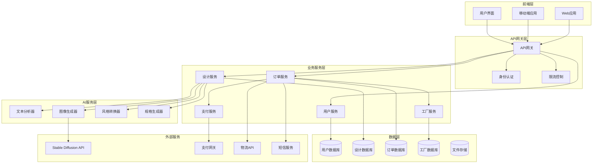

# 设计文档

## 概述

苏绣AI应用是一个基于C2M模式的创新平台，通过AI技术将用户的创意想法转换为专业的苏绣设计图，并连接制造工厂实现从创意到实物的完整流程。系统采用微服务架构，集成先进的AI图像生成技术和传统苏绣工艺知识，为用户提供个性化的苏绣定制服务。

## 架构

### 系统架构图



### 技术栈选择

**前端技术**:
- React/Vue.js - 用户界面框架
- React Native/Flutter - 移动端开发
- Canvas/WebGL - 图像预览和编辑

**后端技术**:
- Node.js/Python - 服务端开发
- Express/FastAPI - Web框架
- Redis - 缓存和会话管理
- PostgreSQL - 关系型数据库
- MongoDB - 文档数据库（设计文件）

**AI技术**:
- Stable Diffusion - 图像生成
- OpenAI GPT - 文本理解
- TensorFlow/PyTorch - 模型推理
- OpenCV - 图像处理

## 组件和接口

### 核心组件

#### 1. 用户管理组件 (UserService)

**职责**: 处理用户注册、登录、个人信息管理

**接口**:
```typescript
interface UserService {
  register(userInfo: UserRegistration): Promise<User>
  login(credentials: LoginCredentials): Promise<AuthToken>
  getUserProfile(userId: string): Promise<UserProfile>
  updateProfile(userId: string, updates: ProfileUpdates): Promise<User>
  getUserHistory(userId: string): Promise<DesignHistory[]>
}
```

#### 2. 设计生成组件 (DesignService)

**职责**: 处理AI设计生成、图像处理、风格转换

**接口**:
```typescript
interface DesignService {
  generateDesign(input: DesignInput): Promise<DesignResult>
  refineDesign(designId: string, refinements: DesignRefinements): Promise<DesignResult>
  previewDesign(designId: string, viewOptions: ViewOptions): Promise<PreviewImage>
  saveDesign(designId: string, userId: string): Promise<SavedDesign>
  getDesignSpecs(designId: string): Promise<ManufacturingSpecs>
}
```

#### 3. AI图像生成组件 (ImageGenerator)

**职责**: 集成外部AI服务，生成苏绣风格图像

**接口**:
```typescript
interface ImageGenerator {
  textToImage(prompt: string, style: EmbroideryStyle): Promise<GeneratedImage>
  imageToImage(sourceImage: Buffer, targetStyle: EmbroideryStyle): Promise<GeneratedImage>
  enhanceImage(image: Buffer, enhancements: ImageEnhancements): Promise<GeneratedImage>
  generateVariations(baseImage: Buffer, count: number): Promise<GeneratedImage[]>
}
```

#### 4. 制作规格生成器 (SpecGenerator)

**职责**: 将设计图转换为制造工厂可用的技术规格

**接口**:
```typescript
interface SpecGenerator {
  generateSpecs(design: DesignImage): Promise<ManufacturingSpecs>
  calculateMaterials(specs: ManufacturingSpecs): Promise<MaterialList>
  estimateTime(specs: ManufacturingSpecs): Promise<TimeEstimate>
  validateSpecs(specs: ManufacturingSpecs): Promise<ValidationResult>
}
```

#### 5. 订单管理组件 (OrderService)

**职责**: 处理订单创建、状态跟踪、支付集成

**接口**:
```typescript
interface OrderService {
  createOrder(orderData: OrderCreation): Promise<Order>
  updateOrderStatus(orderId: string, status: OrderStatus): Promise<Order>
  getOrderDetails(orderId: string): Promise<OrderDetails>
  processPayment(orderId: string, paymentInfo: PaymentInfo): Promise<PaymentResult>
  trackOrder(orderId: string): Promise<TrackingInfo>
}
```

#### 6. 工厂连接组件 (FactoryService)

**职责**: 管理工厂信息、匹配合适工厂、处理生产对接

**接口**:
```typescript
interface FactoryService {
  findSuitableFactory(specs: ManufacturingSpecs, location: Location): Promise<Factory[]>
  sendOrderToFactory(orderId: string, factoryId: string): Promise<FactoryResponse>
  getFactoryCapacity(factoryId: string): Promise<CapacityInfo>
  updateFactoryStatus(factoryId: string, status: FactoryStatus): Promise<void>
  getQualityReport(orderId: string): Promise<QualityReport>
}
```

## 数据模型

### 用户数据模型

```typescript
interface User {
  id: string
  username: string
  email: string
  phone?: string
  avatar?: string
  preferences: UserPreferences
  createdAt: Date
  updatedAt: Date
}

interface UserPreferences {
  language: 'zh' | 'en'
  defaultStyle: EmbroideryStyle
  notifications: NotificationSettings
}
```

### 设计数据模型

```typescript
interface Design {
  id: string
  userId: string
  title: string
  description: string
  originalInput: DesignInput
  generatedImages: GeneratedImage[]
  selectedImage: string
  specifications: ManufacturingSpecs
  status: DesignStatus
  createdAt: Date
  updatedAt: Date
}

interface DesignInput {
  type: 'text' | 'image' | 'mixed'
  textPrompt?: string
  referenceImages?: string[]
  style: EmbroideryStyle
  size: Dimensions
  colorPreferences?: string[]
}

interface ManufacturingSpecs {
  dimensions: Dimensions
  stitchTypes: StitchType[]
  threadColors: ThreadColor[]
  threadQuantities: { [colorCode: string]: number }
  estimatedTime: number
  difficulty: 'easy' | 'medium' | 'hard'
  specialInstructions?: string
}
```

### 订单数据模型

```typescript
interface Order {
  id: string
  userId: string
  designId: string
  factoryId: string
  status: OrderStatus
  pricing: OrderPricing
  timeline: OrderTimeline
  shippingInfo: ShippingInfo
  createdAt: Date
  updatedAt: Date
}

interface OrderStatus {
  current: 'pending' | 'confirmed' | 'in_production' | 'quality_check' | 'shipped' | 'delivered' | 'completed'
  history: StatusHistory[]
}

interface OrderPricing {
  designFee: number
  materialCost: number
  laborCost: number
  shippingCost: number
  totalAmount: number
  currency: string
}
```

### 工厂数据模型

```typescript
interface Factory {
  id: string
  name: string
  location: Location
  capabilities: FactoryCapabilities
  qualityRating: number
  capacity: ProductionCapacity
  certifications: string[]
  contactInfo: ContactInfo
  isActive: boolean
}

interface FactoryCapabilities {
  supportedStyles: EmbroideryStyle[]
  maxDimensions: Dimensions
  specialties: string[]
  qualityLevel: 'standard' | 'premium' | 'luxury'
}
```

## 错误处理

### 错误分类和处理策略

#### 1. 用户输入错误
- **无效文本输入**: 提示用户提供更详细的描述
- **不支持的图像格式**: 自动转换或提示用户重新上传
- **超出尺寸限制**: 提供建议的尺寸范围

#### 2. AI服务错误
- **API调用失败**: 实现重试机制，最多3次
- **生成超时**: 提供预估等待时间，允许用户取消
- **内容过滤**: 提供修改建议，引导用户调整输入

#### 3. 系统错误
- **数据库连接失败**: 实现连接池和故障转移
- **文件存储错误**: 多副本存储，确保数据安全
- **服务不可用**: 降级服务，提供基本功能

#### 4. 业务逻辑错误
- **工厂产能不足**: 推荐替代工厂或延期选项
- **支付失败**: 提供多种支付方式
- **物流异常**: 实时跟踪，主动通知用户

### 错误响应格式

```typescript
interface ErrorResponse {
  code: string
  message: string
  details?: any
  timestamp: Date
  requestId: string
  suggestions?: string[]
}
```

## 测试策略

### 测试层次

#### 1. 单元测试
- **组件测试**: 测试各个服务组件的独立功能
- **工具函数测试**: 测试图像处理、数据转换等工具函数
- **数据模型测试**: 验证数据模型的约束和验证规则

#### 2. 集成测试
- **API集成测试**: 测试与外部AI服务的集成
- **数据库集成测试**: 测试数据持久化和查询功能
- **服务间通信测试**: 测试微服务之间的接口调用

#### 3. 端到端测试
- **用户流程测试**: 模拟完整的用户使用流程
- **性能测试**: 测试系统在高负载下的表现
- **兼容性测试**: 测试不同设备和浏览器的兼容性

### 测试工具和框架
- **单元测试**: Jest, Mocha
- **集成测试**: Supertest, TestContainers
- **端到端测试**: Cypress, Playwright
- **性能测试**: Artillery, K6
- **API测试**: Postman, Newman

## 正确性属性

*属性是一个特征或行为，应该在系统的所有有效执行中保持为真——本质上，是关于系统应该做什么的正式声明。属性作为人类可读规范和机器可验证正确性保证之间的桥梁。*

基于需求分析，以下是系统必须满足的关键正确性属性：

### 属性 1: 输入处理通用性
*对于任何*有效的用户输入（文本或图像），系统应当能够成功接收、解析并生成相应的处理结果
**验证需求: 1.1, 1.2**

### 属性 2: 输入验证一致性  
*对于任何*无效或空白输入，系统应当拒绝处理并提供明确的错误提示或建议
**验证需求: 1.3, 1.4**

### 属性 3: 多语言支持完整性
*对于任何*中文或英文文本输入，系统应当能够正确理解并生成相应的设计结果
**验证需求: 1.5**

### 属性 4: 设计生成性能保证
*对于任何*有效输入，设计生成器应当在30秒内完成初始设计图的生成
**验证需求: 2.1**

### 属性 5: 设计输出完整性
*对于任何*生成的设计，输出应当包含苏绣图案、颜色方案、基本布局，并提供多个方案选择
**验证需求: 2.2, 2.3**

### 属性 6: 设计迭代能力
*对于任何*用户的修改请求，系统应当支持重新生成或微调，并实时显示修改效果
**验证需求: 2.4, 3.4**

### 属性 7: 工艺标准符合性
*对于任何*生成的设计图案，都应当符合苏绣工艺的技术要求和制作标准
**验证需求: 2.5**

### 属性 8: UI功能完整性
*对于任何*设计预览，用户界面应当提供高清显示、缩放旋转、编辑工具等完整功能
**验证需求: 3.1, 3.2, 3.3**

### 属性 9: 数据持久化一致性
*对于任何*用户的编辑操作，系统应当正确保存个性化设计并支持后续访问
**验证需求: 3.5**

### 属性 10: 制作规格完整性
*对于任何*确认的设计，系统应当生成包含尺寸、材料、针法、工艺顺序的完整制作规格
**验证需求: 4.1, 4.2, 4.3, 4.4**

### 属性 11: 规格格式标准化
*对于任何*制作规格输出，都应当采用标准化格式，便于工厂系统解析和处理
**验证需求: 4.5**

### 属性 12: 工厂匹配准确性
*对于任何*设计需求，系统应当根据复杂度和地理位置准确匹配合适的工厂
**验证需求: 5.1**

### 属性 13: 订单流程完整性
*对于任何*订单，系统应当完成创建、工厂对接、通知发送的完整流程
**验证需求: 5.2, 5.3**

### 属性 14: 异常处理及时性
*对于任何*制作过程中的问题或延误，系统应当及时通知用户并提供解决方案
**验证需求: 5.4, 6.4**

### 属性 15: 物流集成完整性
*对于任何*完成的产品，系统应当安排物流配送并提供完整的跟踪信息
**验证需求: 5.5**

### 属性 16: 订单唯一性保证
*对于任何*创建的订单，系统应当分配唯一的跟踪编号，确保不重复
**验证需求: 6.1**

### 属性 17: 状态同步实时性
*对于任何*订单状态变化，系统应当实时更新并在用户查询时显示准确信息
**验证需求: 6.2, 6.3**

### 属性 18: 订单完成流程
*对于任何*配送完成的订单，系统应当请求用户确认收货并提供评价功能
**验证需求: 6.5**

### 属性 19: 用户认证安全性
*对于任何*登录请求，系统应当验证用户身份并安全加载个人信息
**验证需求: 7.2**

### 属性 20: 历史数据完整性
*对于任何*用户的历史查询，系统应当显示完整的设计和订单记录
**验证需求: 7.3**

### 属性 21: 快速下单功能性
*对于任何*历史设计，系统应当支持基于该设计的快速重复下单
**验证需求: 7.4**

### 属性 22: 数据隐私保护
*对于任何*用户数据，系统应当实施加密保护并符合数据保护法规要求
**验证需求: 7.5**

### 属性 23: 质量控制流程
*对于任何*发货前产品，工厂应当完成质量检查并上传检查报告
**验证需求: 8.1**

### 属性 24: 售后服务保障
*对于任何*用户收到的产品，系统应当提供7天退换货服务和问题处理流程
**验证需求: 8.2, 8.3**

### 属性 25: 投诉响应及时性
*对于任何*用户投诉，系统应当在24小时内响应并提供解决方案
**验证需求: 8.4**

### 属性 26: 工厂评价体系
*对于任何*合作工厂，系统应当维护评价体系以确保服务质量
**验证需求: 8.5**